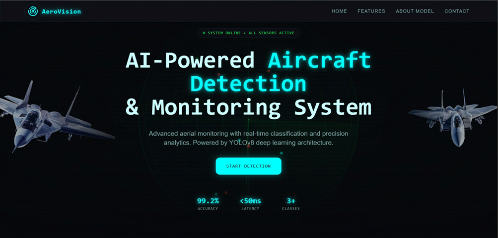
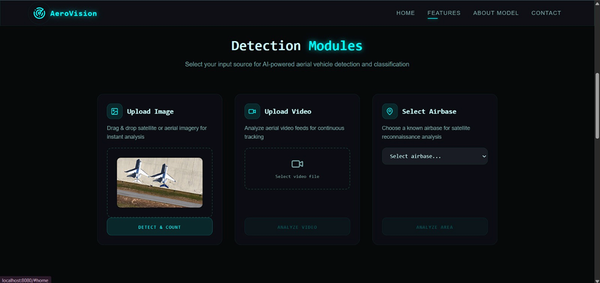
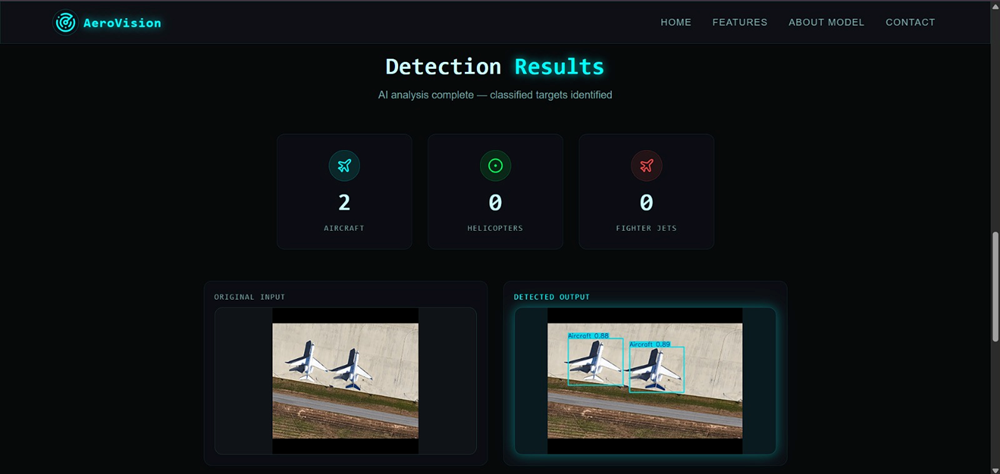

# ✈️ Aircraft Detection System

A full-stack AI-powered web application that detects aircraft in images using deep learning.

## 🚀 Live Demo
🔗 https://aircraft-detection-frontend-jfyuzpzwc.vercel.app/

---

## 🧠 Features

- Upload image and detect aircraft
- YOLO-based deep learning model
- Fast and accurate predictions
- Clean modern UI (React + Vite)
- Flask backend API integration

---

## 🛠 Tech Stack

### Frontend
- React (Vite)
- Tailwind CSS

### Backend
- Flask
- Python

### AI / ML
- YOLOv8
- PyTorch

---

## 📁 Project Structure
```bash
Final-Year-Project/
│
├── backend/
│ ├── app.py
│ ├── tile_pipeline.py
│ └── requirements.txt
│
├── frontend/
│ ├── src/
│ ├── index.html
│ └── package.json
```

---

## ⚙️ Setup Instructions

### 🔹 Backend

```bash
cd backend
pip install -r requirements.txt
python app.py
```
---

## 🔹 Frontend
```
cd frontend
npm install
npm run dev
```
---

## 📸 Demo
### Home Page

### Detection Output

### UI Preview


---

## 📌 Future Improvements

- Add real-time detection (video)
- Deploy backend (Render)
- Improve UI animations


## 👩‍💻 Author

Snehal Barkale
AI & ML Engineer